# Docker to Helm Hands-On Labs

## Exercise 1: Login to Azure and spin up Docker VMs

**STOP**! Please ensure that you have met all the prereqisites as mentioned [earlier](../../README.md).

### Ensure that you are in the right sub-directory

Ensure that you are in sub-directory ex1.

```
cd <path-to-hol-folder>/dockeronazure/exercises/ex1
```

### Login to Azure

Install the `az` CLI from [https://docs.microsoft.com/en-us/cli/azure/install-azure-cli?view=azure-cli-latest](https://docs.microsoft.com/en-us/cli/azure/install-azure-cli?view=azure-cli-latest).

Login to Azure via the CLI. Instructions are at [http://docs.microsoft.com/en-us/cli/azure/authenticate-azure-cli?view=azure-cli-latestllu](https://docs.microsoft.com/en-us/cli/azure/authenticate-azure-cli?view=azure-cli-latest).

After successful login issue the following command

```
az account list
```

```
[
  {
    "cloudName": "AzureCloud",
    "id": "<id 1>",
    "isDefault": false,
    "name": "Visual Studio Enterprise",
    "state": "Enabled",
    "tenantId": "<tenant 1>",
    "user": {
      "name": "<name>@microsoft.com",
      "type": "user"
    }
  },
  {
    "cloudName": "AzureCloud",
    "id": "<id 2>",
    "isDefault": true,
    "name": "AIRS",
    "state": "Enabled",
    "tenantId": "<tenant 2>",
    "user": {
      "name": "<name>@microsoft.com",
      "type": "user"
    }
  }
]
```
### Ensure that you set the right subscription

If you have multiple subscriptions, issue the following command to make sure you set the right subscription.

```
az account set --subscription <correct-id>
```

You can verify that the right subscription is set with the following command

```
az account show
```
which should yield an output that looks something like below.

```
{
  "environmentName": "AzureCloud",
  "id": "id 2",
  "isDefault": true,
  "name": "rags@microsoft",
  "state": "Enabled",
  "tenantId": "tenant 2",
  "user": {
    "name": "rags@microsoft.com",
    "type": "user"
  }
}
```

### Ensure that container instances are supported

Verify that the container instance component is supported in the CLI by running the following command

```
az container list
```

which should yield the following

```
[]
```
or the running containers if you have them running already.

### Install kubectl (if required)

The command `kubectl` is used to manage the Kubernetes (K8s) cluster. This is already installed in the cloud shell. 

If you're using the CLI from your laptop, we will be using the `kubectl` command later. But, let's go ahead and install it right now with the following command

```
az acs kubernetes install-cli
```


### Spin up Docker VMs

#### Generate signing keys

Check if you have signing keys and generate them with the following command. Accept defaults and don't use a passphrase.

```
ls ~/.ssh/id_rsa || ssh-keygen
```

You'll be using the contents of private key - `~/.ssh/id_rsa` and public key - `~/.ssh/id_rsa.pub` later.

#### Spin up VMs via the Portal

##### Provide configuration values

Follow the steps below from the browser pointing to `portal.azure.com`

Click on the `+ New` on the top left and enter `acs` as filter as shown below. Click on `Azure Container Service`

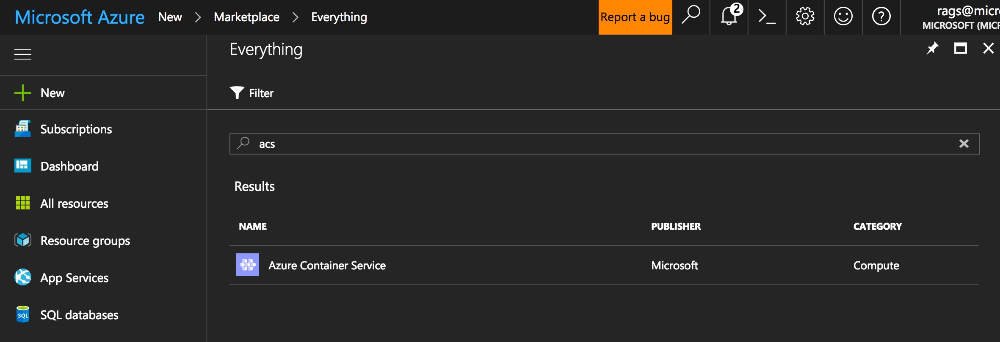

which will bring the following blade. Click on `Create`.

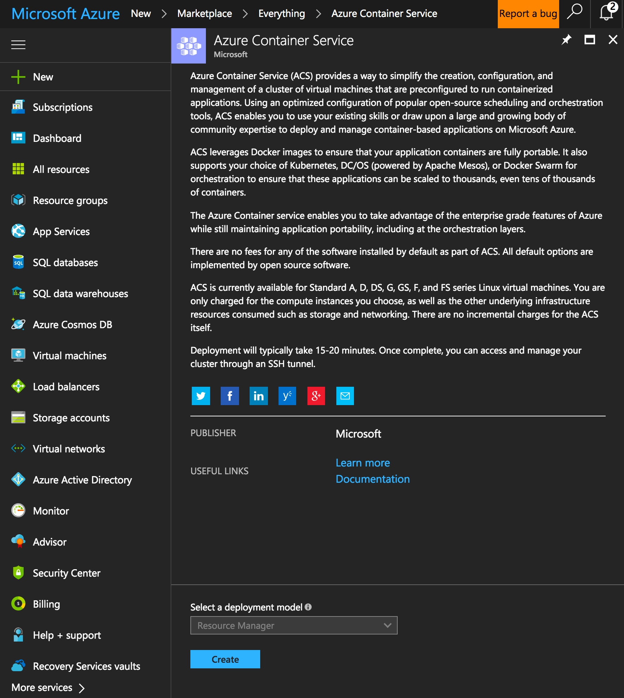

Enter the details required in the `Basics` blade as below, ensuring the names, subscription, resource groups are valid. **Note down the name of the Resource Group**. **Pick `UK West` for the location** since the Docker Swarm cluster in swarm mode may be unavailable at other locations. Click on `OK`.

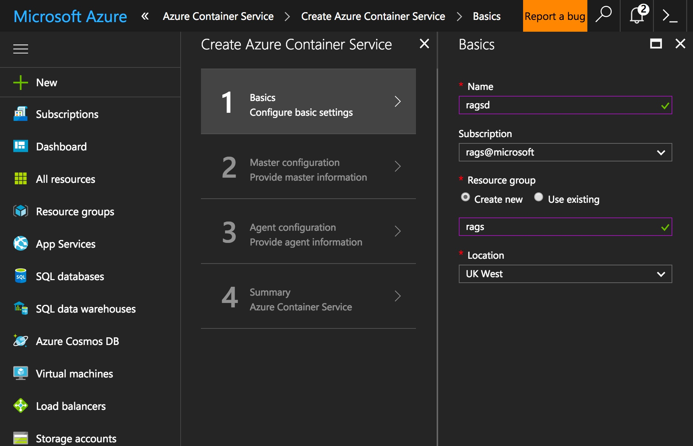

Enter more details in the `Master Configuration` blade as shown below. **Pick `Docker CE(Preview)` for orchestrator**.

Provide a name for the prefix

Provide a login name for the cluster. We will refer to this as `user-id-for-master`. **Note this down**.

Paste the contents of the file from `~/.ssh/id_rsa.pub` including `ssh-rsa` into the `SSH Public Key` window.

Leave the `Master Count` as 1.

Click on `OK`.

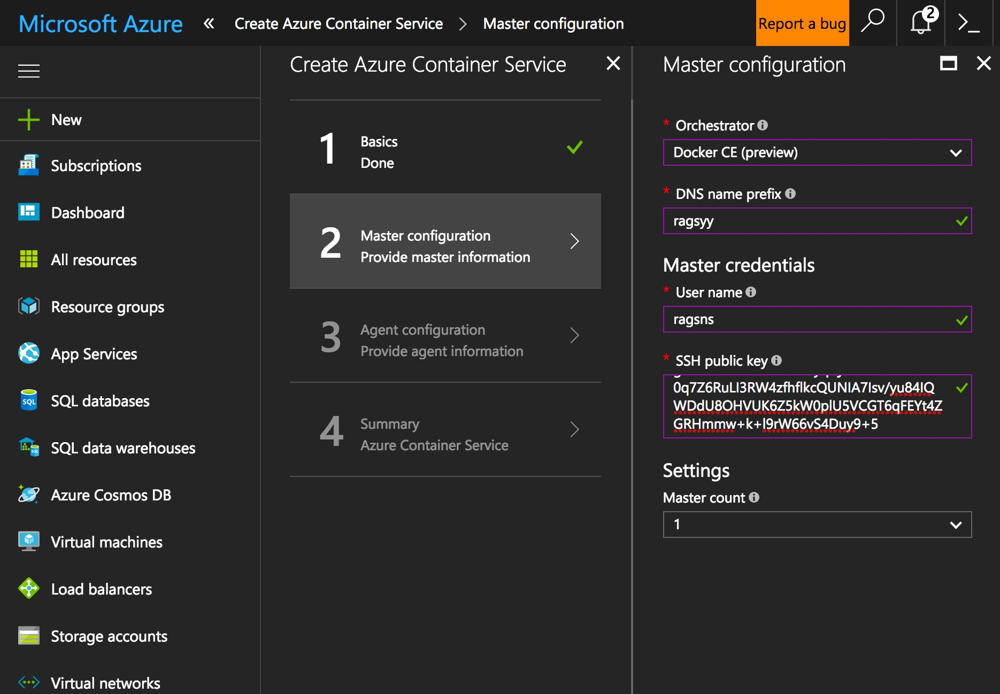

In the `Agent Configuration` Blade pick `HDD` for `Supported Disk Type` and pick a configuration for the agents as shown below.

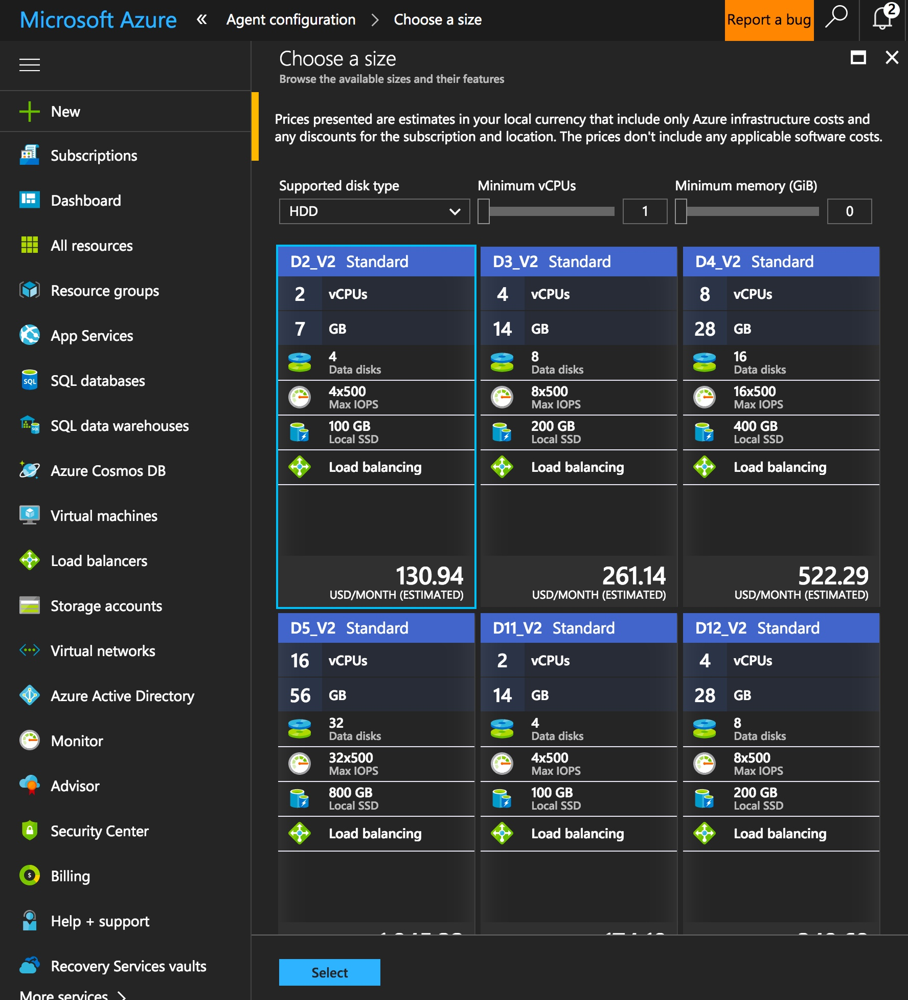

Pick 3 for number of agents as shown below. Hit `OK`.

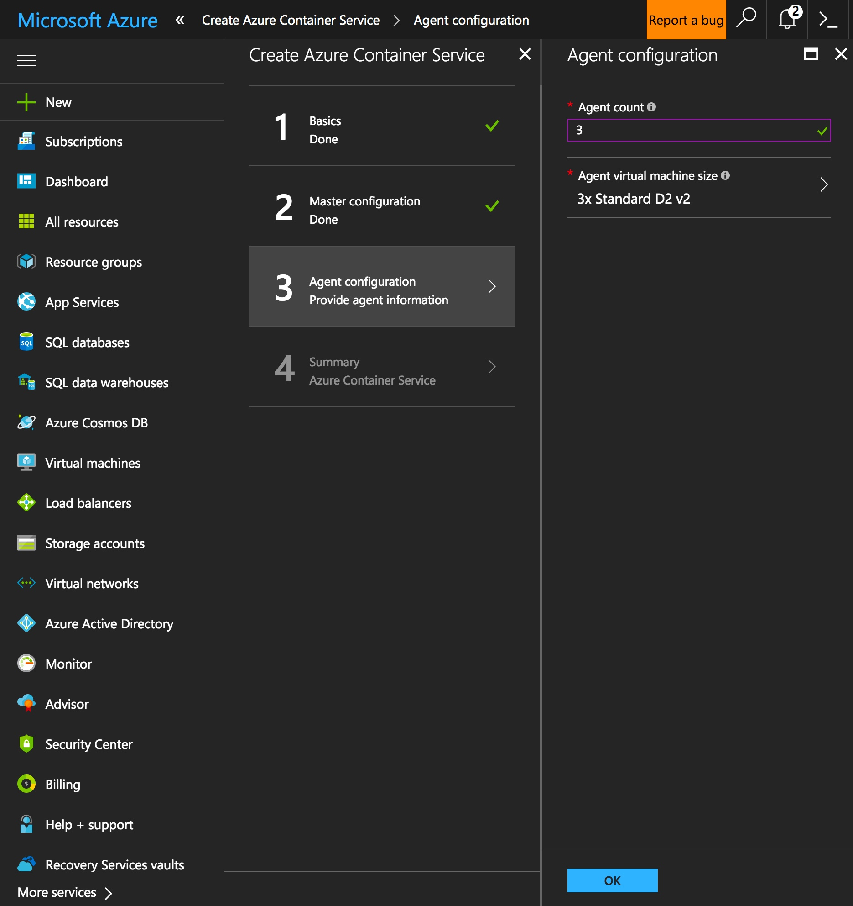

Finally, you'll get a screen that confirms that the `validation passed`. Hit `OK`.

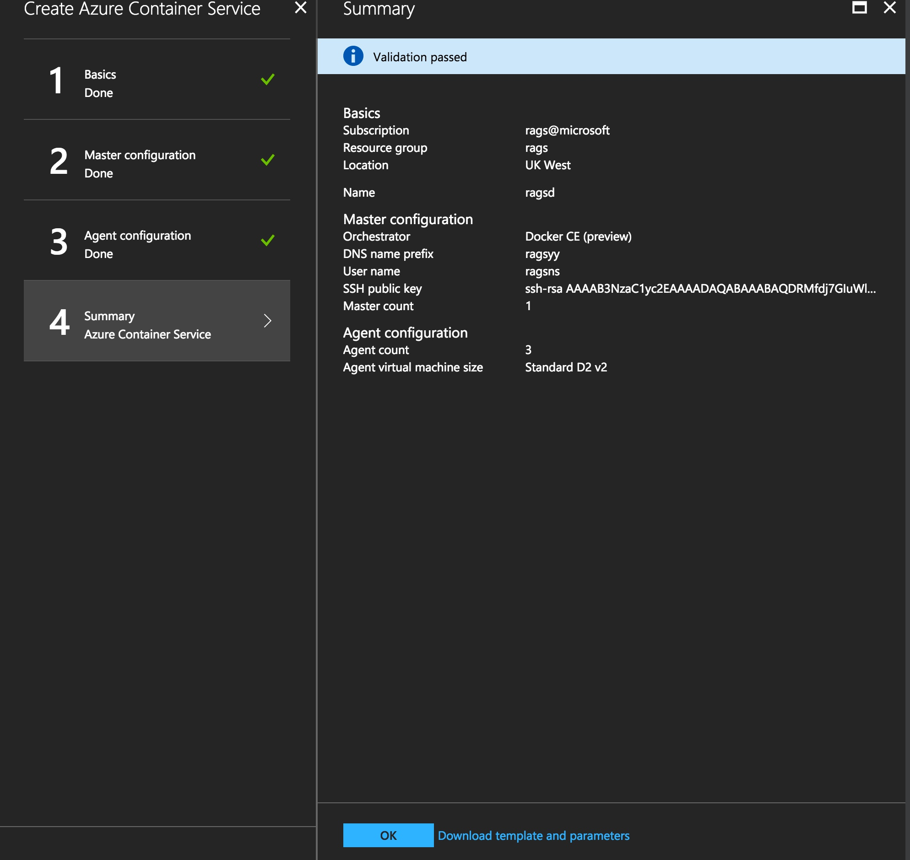

**Wait for a while** for the Docker Swarm cluster in Swarm mode to be created.

##### Get the IP address of the master

Click on `Resource Groups` and provide the name of the Resource Group as a filter.

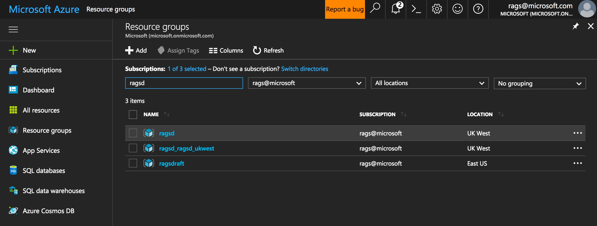

Click on the name with the location of the Resource Group (in this case with the suffix `ukwest`) that was auto-generated. This will show the resources created under the Resource Group.

Now provide the filter `master` which will bring up a few entries as shown below.

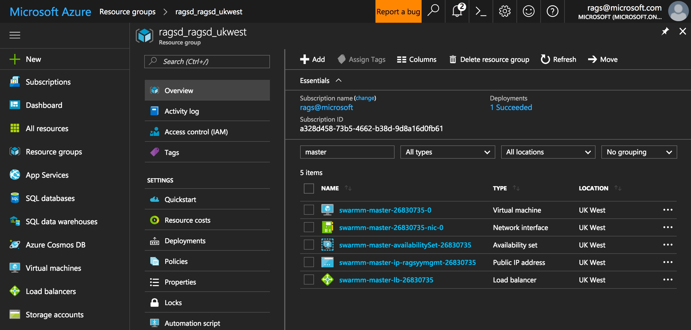

Click on the line with the `Virtual Machine` as TYPE which will show the IP as shown below.

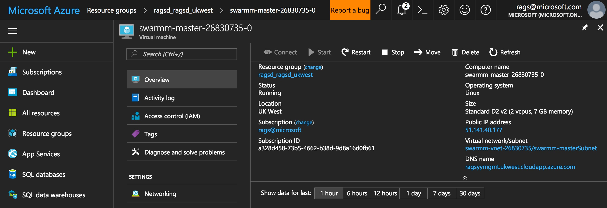

In this case it is `51.141.40.177` which is the IP address of the master which we'll refer to as `ip-of-master`.

##### ssh into the master

ssh into the master as below.

```
ssh <user-id-of-master>@<ip-of-master>
```

Accept the prompt and if everything goes well you should be able to be logged into master as shown below.

```
ragsns@swarmm-master-26830735-0:~$ 
```

Assume that the cluster configured correctly using the following command

```
docker node ls
```

Which should yield an output that looks something like below and indicates a master count of 1 and an agent count of 3.

```
ID                           HOSTNAME                         STATUS  AVAILABILITY  MANAGER STATUS
8e8qa1vm66534w5hoc0o5v9pt *  swarmm-master-26830735-0         Ready   Pause         Leader
i80wvdub8g47eecem8fqxx8kn    swarmm-agentpool-26830735000000  Ready   Active        
lx5ifv7o16ri19xjb189ig12d    swarmm-agentpool-26830735000004  Ready   Active        
mg7sinoolwjkxmyxc6lc79wal    swarmm-agentpool-26830735000003  Ready   Active     
```

Paste the contents of the file `~/.ssh/id_rsa` from laptop into the master as below and hit <ctrl-d>

```
cat >> ~/.ssh/id_rsa
```

Ensure the contents are OK with the following command

```
cat ~/.ssh/id_rsa
```

Change the permissions as below

```
chmod 0400 ~/.ssh/id_rsa
```

This will ensure that you can `ssh` into the agents. Ensure that you can do it.

```
ssh $(docker node ls | grep -i agent | awk '{print $2}' | tail -1)
```

Acknowledge `yes` to the prompt (if required) as shown below

```
The authenticity of host 'swarmm-agentpool-26830735000003 (10.0.0.7)' can't be established.
ECDSA key fingerprint is SHA256:itOwe78cMffncvJX2PtmQySJbvLLYbfKhceRu4gBQBc.
Are you sure you want to continue connecting (yes/no)? yes
```

##### Open up ports 80, 8080 and 5000

Click on the `Resource Groups` and the resource group name in the filter with the generated resource group with the suffix `ukwest` as we did before.

Now provide the filter `master-lb` to drill down on the load balancer and click on the load balancer as shown below.

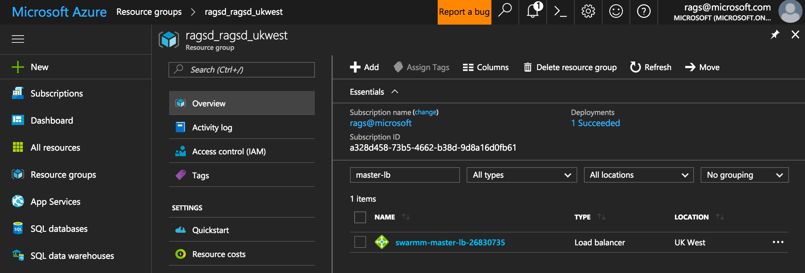

Click on `Inbound NAT rules` as shown below.

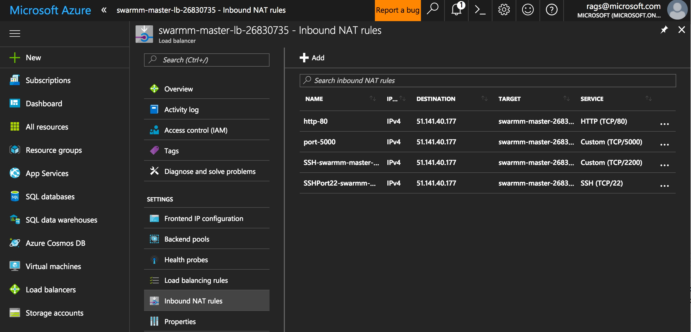

Now click on `+Add`.

on the `Add inbound NAT rule` add a rule for port 8080 as shown below and hit `OK`.

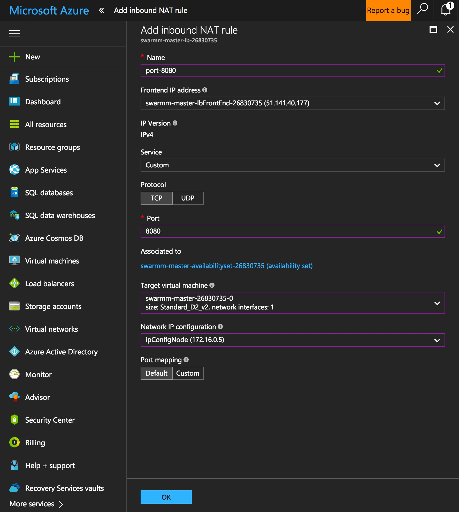

Click on the rule again and redo the rule as shown below and click `Save`. 

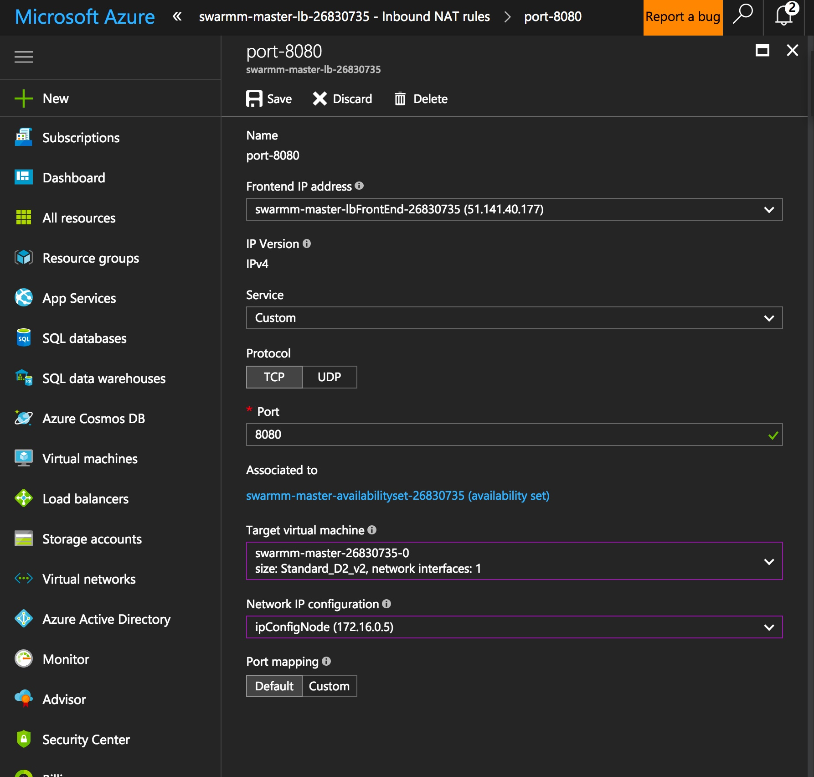

It might take a while for the button to be available. Close the window.

Repeat the process for ports 80 and 5000.

Make sure the rules look something like below.

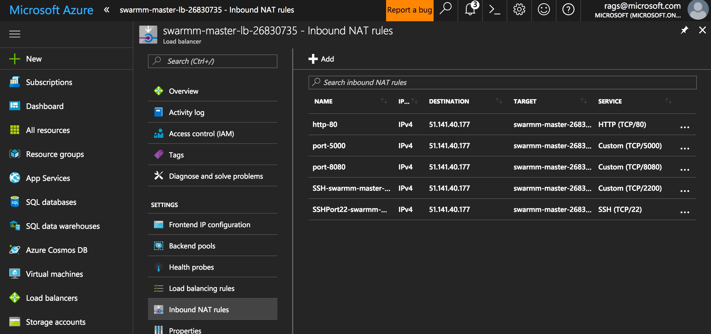

### Summary and Next Steps

We created a Docker cluster simply on Azure and opened up ports on the load balancer that has an IP address associated. We'll be using this cluster in subsequent exercises.

Next, we'll walk through some simple Docker commands in the [gentle intro](../ex2).
