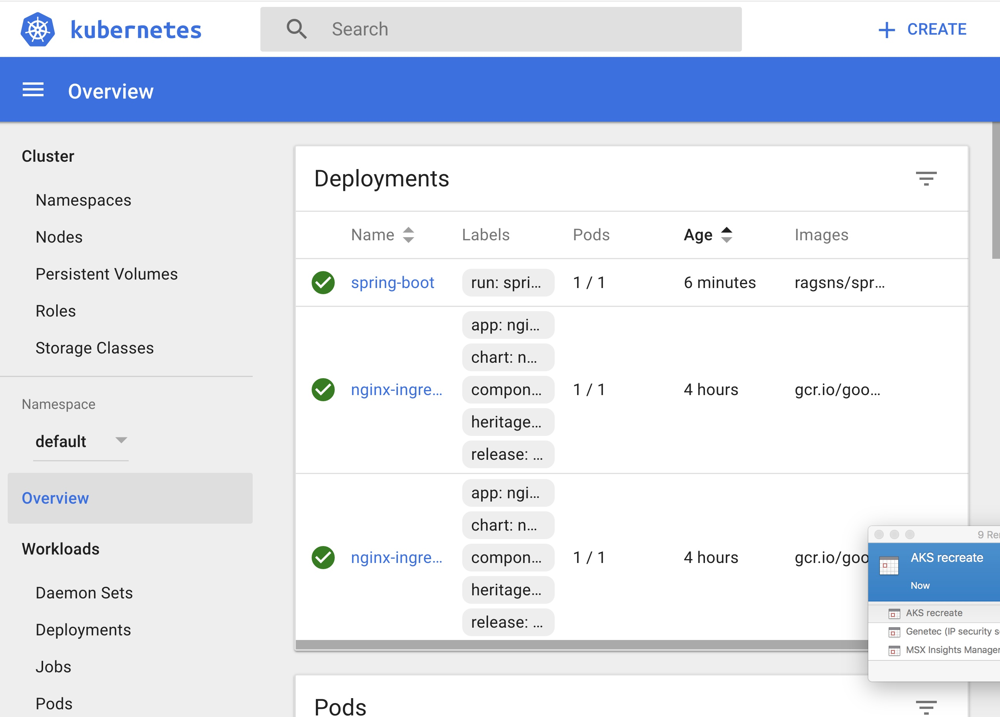

# Docker to Helm Hands-On Labs

## Exercise 5b: Kubernetes with Azure Kubernetes Services (AKS)

**STOP**! Please ensure that you have met all the prereqisites as mentioned [earlier](../../README.md).

### Kubernetes

We saw in the previous exercise that Azure Container Service (ACS) provides a way to simplify the creation, configuration, and management of a cluster of virtual machines that are preconfigured to run containerized applications. 


### Creating a Kubernetes cluster on Azure using AKS

Unlike the Azure Container Services, Azure Kubernetes Service is a more Platform as a Service (PaaS) approach making it easier to rollout upgrades to the cluster
Let's use the `az` CLI to spin up a Kubernetes cluster.

Verify that you're logged into Azure and set the right subscription with the following command as mentioned in a [previous execrise](../ex1/README.md).

```
az account show
```

We create the cluster using the following commands. You could do this from the Azure portal as well. (**unique names (USE INITIALS if required**). 


```
export UNIQUE_NAME=ragsAKS
```

You may have make these names unique by tagging your name if the cluster creation fails later

Let's start with creating a single node AKS Cluster,

```
az aks create --resource-group $UNIQUE_NAME --name UNIQUE_NAME --node-count 1 --generate-ssh-keys 

```

If not done earlier, to manage the Kubernetes cluster, use `kubectl`, the Kubernetes command-line client.

If you're using Azure CloudShell, `kubectl` is already installed. If you want to install it locally, like on your laptop, you can use the  following command

```
az acs kubernetes install-cli
```

To configure kubectl to connect to your Kubernetes cluster, run the following command.

```
az aks get-credentials --resource-group=$UNIQUE_NAME --name=$UNIQUE_NAME
```

This step downloads credentials and configures the Kubernetes CLI to use them.

Ensure that the context is set appropriately with the following command.

```
kubectl config use-context $UNIQUE_NAME
```

To verify the connection to your cluster, use the kubectl get command to return a list of the cluster nodes.

```
kubectl get nodes
```

which will yield an output that looks something like below.

```
NAME                       STATUS    AGE       VERSION
aks-nodepool1-34933344-0   Ready     4h        v1.7.7
```

You can get the cluster information with the following command.

```
kubectl cluster-info
```

which should yield an output something like below.

```
Kubernetes master is running at https://ragsaks-ragsaks-a328d4-3cb1d9a4.hcp.eastus.azmk8s.io:443
Heapster is running at https://ragsaks-ragsaks-a328d4-3cb1d9a4.hcp.eastus.azmk8s.io:443/api/v1/namespaces/kube-system/services/heapster/proxy
KubeDNS is running at https://ragsaks-ragsaks-a328d4-3cb1d9a4.hcp.eastus.azmk8s.io:443/api/v1/namespaces/kube-system/services/kube-dns/proxy
kubernetes-dashboard is running at https://ragsaks-ragsaks-a328d4-3cb1d9a4.hcp.eastus.azmk8s.io:443/api/v1/namespaces/kube-system/services/kubernetes-dashboard/proxy
```

### Create a Deployment

To create the deployment, use the following command.

```
kubectl run spring-boot --image=ragsns/spring-boot --port=8080
```


### Create a Proxy

Create a proxy with the following command.

```
az aks browse --resource-group $UNIQUE_NAME --name $UNIQUE_NAME
```

which will launch a browser window and provides details about the cluster which looks something like below.



```
Starting to serve on 127.0.0.1:8001
```

Poke around the cluster to look at the different artifacts.

### Create a Load Balancer

Let's expose a Load Balancer with an external IP as below.

```
kubectl expose deploy/spring-boot --type="LoadBalancer" --port 8080 --target-port 8080
```

Now run the following command unti you see an external IP generated.

```
kubectl get service spring-boot --watch
```

You should see something like below with the second line containing the external IP as shown below.

```
NAME          CLUSTER-IP    EXTERNAL-IP   PORT(S)          AGE

spring-boot   10.0.161.93   <pending>     8080:31279/TCP   20s

spring-boot   10.0.161.93   52.168.37.19   8080:31279/TCP   1m
```

The service is now available at the external IP. 

```
export EXTERNAL_IP=$(kubectl get service spring-boot | tail -1 | awk '{print $3}')
echo $EXTERNAL_IP
```

You can invoke the service via the external IP as below.

```
curl $EXTERNAL_IP:8080
```

### Scaling the service

Scale the service using the following command

```
kubectl scale deployments/spring-boot --replicas=2
```

Running the following command

```
kubectl get pods | grep -i spring-boot
```

will yield the pods running the service as shown below.

```
spring-boot-439464631-v1pzx                                    1/1       Running   0          10s
spring-boot-439464631-x466x                                    1/1       Running   0          33m
```

### Application Self-Healing

Terminating an instance of the service with the command below

```
curl $EXTERNAL_IP:8080/exit
```

indicates termination as below

```
curl: (52) Empty reply from server
```

Running the following command 

```
kubectl get deployments | grep -i spring-boot
```

shows the number of running instances to 1 and eventually back to 2.

```
spring-boot                                   2         2         2            1           36m
spring-boot                                   2         2         2            2           36m
```

### Upgrade the Service

The service can be upgraded as below

```
kubectl set image deployments/spring-boot spring-boot=ragsns/spring-boot:v2
```

and run the following command **immediately** 

```
kubectl rollout status deployments/spring-boot
```
which yields an output something like below showing the status of the rolling upgrade.

```
Waiting for rollout to finish: 1 old replicas are pending termination...
Waiting for rollout to finish: 1 old replicas are pending termination...
Waiting for rollout to finish: 1 old replicas are pending termination...
deployment "spring-boot" successfully rolled out

```

Running the command below verifies that the service was updated

```
curl $EXTERNAL_IP:8080/exit

```

with the output from the updated service as below.

```
Hello World v2!
```

### Rolling back the upgrades

You can rollback the upgrade using the following command

```
kubectl rollout undo deployments/spring-boot
```

Running the following command again

```
curl $EXTERNAL_IP:8080/exit
```

which yields the following output indicating the service was rolled back.

```
Hello World!
```

### Using a YAML file for the configuration

Rather than use the `kubectl` command it might be easier to use an `YAML` file to do the same.

Create a file name `spring-boot.yaml` with the following contents.

```
---
apiVersion: apps/v1beta1
kind: Deployment
metadata:
  name: spring-boot
spec:
  replicas: 1
  template:
    metadata:
      labels:
        app: spring-boot
    spec:
      containers:
      - name: spring-boot
        image: ragsns/spring-boot
        ports:
        - containerPort: 8080
---
apiVersion: v1
kind: Service
metadata:
  name: spring-boot
spec:
  type: LoadBalancer
  ports:
  - port: 8080
  selector:
    app: spring-boot
```

Let's delete the deployment with the following command.

```
kubectl delete deploy/spring-boot
```

Let's delete the service with the following command.

```
kubectl delete svc spring-boot
```

Let's recreate the service and the `LoadBalancer` by using `spring-boot.yaml` file that we just created with the following command.

```
kubectl create -f spring-boot.yaml
```

Which will show the creation of the deployment and service as below.

```
deployment "spring-boot" created
service "spring-boot" created
```

Running the watch command as we did before, will show the external IP where the service can be invoked as below.

```
NAME          CLUSTER-IP     EXTERNAL-IP   PORT(S)          AGE
spring-boot   10.0.108.144   <pending>     8080:30505/TCP   7s
spring-boot   10.0.108.144   52.226.19.235   8080:30505/TCP   2m
```

The service is now available via the new external IP.

### Clean up


To delete the deployment, run the following command.

```
kubectl delete deploy/spring-boot
```

To delete the service, run the following command.

```
kubectl delete svc spring-boot
```

### Summary and Next Steps

We started with some simple Docker commands in earlier exercises and used Docker compose but they still don't make it easy to scale and self heal.

Using Docker swarm in swarm mode we're able to meet some of the tenets of an application such as self-healing, scaling, rolling upgrades and so on.

We used Kubernetes as an orchestrator in this exercise to essentially accomplish the same things we did in the previous exercise.

More Kubernetes command information is at [https://kubernetes.io/docs/tutorials/kubernetes-basics/](https://kubernetes.io/docs/tutorials/kubernetes-basics/). You don't have to worry about the `minikube` part of the tutorial since a cluster was spun up on Azure.

Kubernetes still seems more like infrastructure and we'll look at [Helm and Draft](../ex6) which provides a more application perspective.